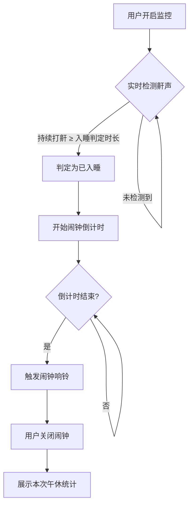

# 午休卫士 (Nap Guard) — 产品需求文档 (PRD)

**版本**：v1.0  
**日期**：2026-03-02  
**状态**：草稿  
**平台**：Android

---

## 一、产品背景

### 1.1 痛点与动机

用户在周末及工作日午休时，常常因入睡过久而打乱夜间睡眠节律。传统的直接定时闹钟无法解决"还没睡着就被吵醒"的问题，体验较差。

### 1.2 产品定位

**午休卫士**是一款专为午休场景设计的 Android 智能闹钟应用。它通过实时麦克风音频分析，自动识别用户是否开始稳定熟睡（判定标准：持续打鼾），并在此之后的设定时长后自动唤醒用户，实现「从真正入睡时开始计时」的科学午休体验。

### 1.3 目标用户

- 有午休习惯但经常睡太久的上班族/学生
- 对睡眠和健康管理有一定意识的用户

---

## 二、核心逻辑（系统流程）

---

## 三、页面与功能需求

### 3.1 主控制台（首页）

> **目标**：让用户在最短时间内完成参数配置并启动监控。

#### 3.1.1 界面元素

| 元素 | 描述 |
|------|------|
| 应用标题 | "午休卫士"，大号加粗，位于页面左上 |
| 副标题 | "智能监控鼾声，科学唤醒午睡"，灰色辅助说明 |
| 设置卡片 | iOS 列表式卡片，包含两项可配置参数 |
| 闹钟时长 | 默认 **30 分钟**；用户可点击修改；值以绿色高亮显示 |
| 入睡判定 | 默认 **5 分钟**（即持续打鼾超过 5 分钟判定入睡）；用户可点击修改 |
| 开启按钮 | 绿色主按钮，文案"开启午休监控" |
| 按钮说明 | 按钮下方灰色小字："开启后手机将实时检测你的鼾声" |
| 最近记录 | 展示最近一次午休记录（时间 + 时长）；若无记录则隐藏 |

#### 3.1.2 交互逻辑

- **点击"闹钟时长"**：弹出数字选择器（步进：5 分钟，范围：10～120 分钟）
- **点击"入睡判定"**：弹出数字选择器（步进：1 分钟，范围：1～15 分钟）
- **点击"开启午休监控"**：
  1. 请求麦克风权限（首次使用）
  2. 跳转到 **睡眠监控页**
  3. 同时在后台开始录音分析

---

### 3.2 睡眠监控页

> **目标**：让用户感受到"系统正在运作"，并可随时中止。

#### 3.2.1 界面元素

| 元素 | 描述 |
|------|------|
| 状态标题 | "正在监控睡眠"，灰色，居中 |
| 计时器 | 当前监控已运行时长，大字体（倒计时 or 正计时） |
| 麦克风图标 | 绿色描边圆形，内嵌麦克风图标；检测到声音时触发脉动动画 |
| 检测状态文字 | 实时更新，如"已检测到鼾声..."；未检测到时显示"正在检测鼾声..." |
| 已检测提示 | "已持续检测 X 分钟" |
| 底部说明 | "持续打鼾满 N 分钟后将自动开启闹钟"（N 为用户设定值） |
| 取消按钮 | 边框按钮，文案"× 取消监控"，位于页面底部 |

#### 3.2.2 交互逻辑

- **页面加载**：立即开始麦克风采集，开始计时
- **检测到鼾声**：麦克风图标触发脉动动画；状态文字切换为"已检测到鼾声..."；显示持续时长
- **鼾声中断**：状态文字恢复"正在检测鼾声..."；持续时长重置
- **达到入睡判定时长**：停止检测，自动进入闹钟倒计时（当前页面更新状态文字即可）；后台静默运行
- **倒计时结束**：跳转至 **闹钟页**，触发响铃
- **点击"取消监控"**：弹出二次确认对话框 → 确认后停止所有检测并返回首页，**不记录本次记录**

> [!IMPORTANT]
> 倒计时阶段，应用需在后台持续运行（Foreground Service），防止系统回收进程。

---

### 3.3 闹钟页

> **目标**：以最清晰的方式唤醒用户，并展示本次午休总结。

#### 3.3.1 界面元素

| 元素 | 描述 |
|------|------|
| 闹钟图标 | 绿色闹钟图标，居中显示 |
| 主标题 | "该起床啦"，大号加粗 |
| 副标题 | "已完成预定午休目标"，灰色说明 |
| 统计卡片 | 白色卡片，内含两项数据 |
| 总时长 | 本次从开启到闹钟响共经过的时间 |
| 稳睡时长 | 判定入睡后到闹钟响之间的时间（即用户设定的闹钟时长）|
| 关闭按钮 | 绿色主按钮，文案"关闭闹钟" |

#### 3.3.2 交互逻辑

- **页面出现时**：
  1. 立即播放闹钟铃声（可选：手机振动）
  2. 背景发光/振动动效（可选增强感知）
- **点击"关闭闹钟"**：
  1. 停止铃声
  2. 将本次记录（日期、时长）写入本地存储
  3. 返回首页，首页"最近记录"更新
- **音量键物理按键**：也可关闭铃声（不关闭页面）

> [!NOTE]
> 若用户在锁屏状态下，闹钟页应出现在锁屏之上（需申请 `USE_FULL_SCREEN_INTENT` 权限）。

---

## 四、权限需求

| 权限 | 用途 | 时机 |
|------|------|------|
| `RECORD_AUDIO` | 实时录音，分析鼾声 | 点击"开启午休监控"时申请 |
| `FOREGROUND_SERVICE` | 保持后台持续监测 | 开启监控时启用 |
| `WAKE_LOCK` | 防止设备在闹钟前睡眠 | 随 Foreground Service |
| `USE_FULL_SCREEN_INTENT` | 锁屏上弹出闹钟页 | 安装时申请（Android 14+） |
| `SCHEDULE_EXACT_ALARM` | 精确定时闹钟 | 安装时引导用户授权 |

---

## 五、数据存储

| 数据项 | 实现方式 |
|--------|----------|
| 用户设置（时长、判定阈值） | SharedPreferences 本地存储 |
| 睡眠记录（日期、总时长） | Room 数据库，仅存储本地 |
| 无云同步需求（v1.0） | — |

---

## 六、非功能性需求

| 维度 | 要求 |
|------|------|
| **性能** | 音频分析在子线程中运行，不阻塞 UI；CPU 占用 < 10% |
| **可靠性** | Foreground Service 保证后台不被系统回收 |
| **电量** | 尽量减少录音采样频率；在确认入睡后降低采样率 |
| **隐私** | 录音数据**不上传、不存储**音频文件；仅做实时分析 |
| **兼容性** | 支持 Android 8.0 (API 26) 及以上 |
| **语言** | 简体中文（v1.0 仅支持中文） |

---

## 七、未来版本规划（Backlog）

- [ ] 睡眠历史记录页（周/月统计图表）
- [ ] 鼾声录音片段保存（用户可回听）
- [ ] 自定义铃声
- [ ] 小组件（桌面快捷开启）
- [ ] Apple Watch / 穿戴设备联动检测（不依赖麦克风）
